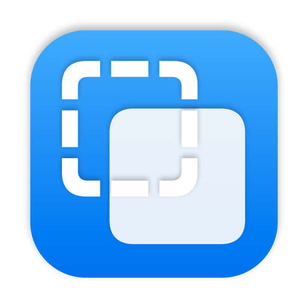

  

<h1 align="center">BitBridge</h1>

  <b>One clipboard, shared by two Macs.</b> 
  Select text on yours, paste it on theirs.

  
  
  
  

 

You and a colleague are on a call. They need the link, the snippet, the error message you are looking at. Instead of pasting it into a chat app, you highlight it and press <kbd>⌃</kbd> <kbd>⌥</kbd> <kbd>C</kbd>. On their Mac, <kbd>⌃</kbd> <kbd>⌥</kbd> <kbd>V</kbd> types it straight into whatever window they have open.

That is the whole app. It lives quietly in the menu bar, has no account, no window to manage and no history to clean up.

## Two shortcuts

<table>
  <tr>
    <td><kbd>⌃</kbd> <kbd>⌥</kbd> <kbd>C</kbd></td>
    <td><b>Share</b></td>
    <td>Copies your current selection and sends it to everyone in the room.</td>
  </tr>
  <tr>
    <td><kbd>⌃</kbd> <kbd>⌥</kbd> <kbd>V</kbd></td>
    <td><b>Paste</b></td>
    <td>Pastes the latest shared clip right where your cursor is.</td>
  </tr>
</table>

The menu bar icon tells you what happened at a glance: a filled square when something new has arrived, a checkmark when a clip went out, a dashed outline while it reconnects.

## Pairing

One Mac creates a sixteen character code, the other types it in. That code is the only thing the two Macs ever share, and it is enough for everything: where to meet and how to lock the messages. More than two Macs can join the same code, and BitBridge shows who is in the room by name.

## Private by design

The pairing code never leaves your Macs. From it, BitBridge derives two separate values with HKDF:

1. **A 256 bit key.** Every clip is compressed and sealed with AES GCM before it leaves your machine.
2. **An anonymous topic name.** Clips travel through [ntfy.sh](https://ntfy.sh), a free open source relay. It sees a random looking hash and ciphertext, nothing else.

If one Mac is asleep or offline, it catches up on missed clips for up to twelve hours as soon as it is back.

## Building

Open `BitBridge.xcodeproj` in Xcode 26 and run. On first launch a short onboarding asks for your name, lets you practice both shortcuts once and requests **Accessibility** access, which BitBridge needs to press <kbd>⌘</kbd> <kbd>C</kbd> and <kbd>⌘</kbd> <kbd>V</kbd> on your behalf. Without it, shared text still lands on your clipboard; you just paste it yourself.

 

  Made by Lovis Steinmayer · Released under the <a href="LICENSE">MIT License</a>

